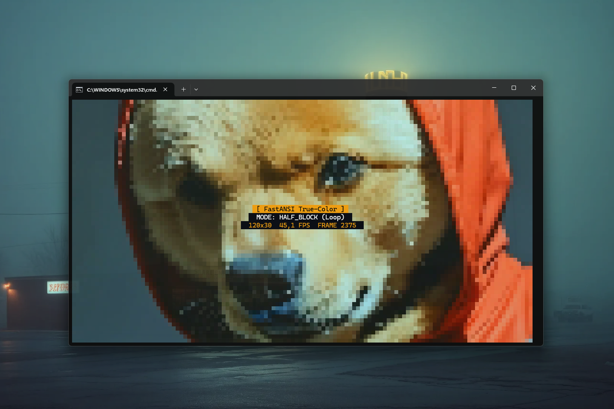

# FastANSI 0.1.2 — High-Performance ANSI & VT Escape Sequence Parser for Java

[](https://github.com/andrestubbe/FastANSI/releases/tag/v0.1.2)
[](https://opensource.org/licenses/MIT)
[](https://www.java.com)
[]()
[](https://jitpack.io/#andrestubbe/FastANSI)

---

**⚡ A zero-dependency, zero-allocation UTF-16 ANSI and VT100/VT220/Xterm escape sequence parser for Java, engineered for
ultra-high-performance TUI layouts, terminal graphics, and console telemetry pipelines.**

FastANSI is the dedicated high-speed text processing substrate of the **FastJava** ecosystem. It introduces a highly
optimized, stack-free procedural state machine designed to parse raw terminal output streams containing styles, cursor
movements, and custom colors into structured cell representations at the physical hardware level.

To achieve a completely responsive, zero-latency desktop terminal experience, FastANSI is built to pair natively with the rendering module of the **FastJava** ecosystem:

* 🚀 **[FastTerminal](https://github.com/andrestubbe/FastTerminal)** — Direct, low-latency, hardware-accelerated 24-bit True Color terminal rendering engine.

By operating with absolutely **exactly zero object allocations** on the Java heap, FastANSI is 100%
garbage-collection-free and suited to run in demanding, high-throughput console-composing pipelines.

---

[**Watch the Demo**](https://www.youtube.com/watch?v=mzIAnXfqXQs) | [**Watch the JMH Benchmark**](https://www.youtube.com/watch?v=SEEYP7PdYNk)

[](https://www.youtube.com/watch?v=mzIAnXfqXQs)

---

## Table of Contents

- [Why FastANSI?](#why-fastansi)
- [Key Features](#key-features)
- [Performance](#performance)
- [API Quick Reference](#api-quick-reference)
- [Installation](#installation)
- [Documentation](#documentation)
- [Platform Support](#platform-support)
- [Related Projects](#related-projects)
- [License](#license)

---

## Why FastANSI?

The mission is to establish the fastest, most comprehensive escape sequence parser in the JVM universe. FastANSI enables
terminal viewports to consume raw external ANSI dumps dynamically, process global terminal styling, and support custom
24-bit True Color rendering with zero garbage collection overhead.

---


## Quick Start

```java
import fastansi.FastANSI;

public class Demo {
    public static void main(String[] args) {
        String ansiStream = "Hello \033[1;31mRed Bold\033[0m Text!";

        FastANSI.parse(ansiStream, new FastANSI.ANSIListener() {
            @Override
            public void onText(CharSequence text, int start, int end) {
                System.out.println("Text: " + text.subSequence(start, end));
            }

            @Override
            public void onReset() {
                System.out.println("Reset Styles");
            }

            @Override
            public void onBold(boolean enable) {
                System.out.println("Bold: " + enable);
            }

            @Override
            public void onForegroundColor(int colorType, int r, int g, int b) {
                System.out.println("FG Color - Type: " + colorType + ", R:" + r);
            }

            // ... Implement other low-overhead cursor & mode callbacks
        });
    }
}
```

---

## Key Features

* **🚫 Zero Dependencies** — Completely standalone, lightweight, pure Java 17 library.
* **⚡ Zero Heap Allocation** — Renders cell properties purely using coordinate pointers (`start`, `end`) and primitives,
  avoiding all standard String splits or regex overhead.
* **🎨 Complete Color & Style Support** — Full parsing of standard SGR parameters (bold, italic, underlines, standard
  4-bit, 8-bit index, and 24-bit True Color RGB).
* **📏 Cursor & Erase Commands** — Recognizes all standard VT navigation codes (Cursor up/down/forward/backward, cursor
  absolute, display/line erasing).
* **📺 Private & OSC Operating Modes** — Detects alternate screen buffers (`?1049h`/`l`), cursor display toggles (`?25h`/
  `l`), and window title adjustments via Operating System Commands (OSC).
* **🖼️ Native 1:1 SIXEL Graphics** — Integrated SIXEL protocol encoder (`FastAnsiImage.Mode.SIXEL`, `toSixel()`, `writeSixel()`) for native 1:1 screen pixel rendering in modern terminals.

---

## Performance

FastANSI is rigorously profiled using **JMH** to guarantee zero overhead.
[**Watch the JMH Benchmark**](https://www.youtube.com/watch?v=SEEYP7PdYNk)

*Benchmark: Stripping ANSI escape codes from a text string.*

| Operation | Standard Regex (`replaceAll`) | FastANSI State Engine | Speedup | Allocations (GC) |
| :--- | :--- | :--- | :--- | :--- |
| **Strip ANSI String** | ~478 ns / op | **~99 ns / op** | **~4.8x** | **Zero** |

*Measured on Windows 11, Intel Core i5-1135G7 (Surface Pro 8), JDK 25.0.1. The engine bypasses `Thread.sleep` via `FastDWM` to guarantee zero-jitter native heartbeats even under GC pressure.*


---

## API Quick Reference

| Method                   | Description                                                                            | Path                              |
|--------------------------|----------------------------------------------------------------------------------------|-----------------------------------|
| `parse(input, listener)` | Parses a text stream procedurally, triggering corresponding callbacks on the listener. | [Reference →](docs/REFERENCE.md#parse) |
| `fg(r, g, b)` / `fg(idx)`| Generates 24-bit TrueColor or 8-bit index foreground ANSI escape sequences.            | `FastANSI.java`                   |
| `bg(r, g, b)` / `bg(idx)`| Generates 24-bit TrueColor or 8-bit index background ANSI escape sequences.            | `FastANSI.java`                   |
| `cursorTo(row, col)`     | Generates cursor absolute positioning escape codes.                                    | `FastANSI.java`                   |
| `FastAnsiImage.toSixel`  | Encodes a `BufferedImage` into a 1:1 native SIXEL pixel escape sequence string.        | `FastAnsiImage.java`              |

> [!TIP]
> See **[REFERENCE.md](docs/REFERENCE.md)** for complete callback listings, SGR color codes, and parsed parameters.

---

## Installation

FastANSI is pure-Java and has **zero external dependencies**.

### Option 1: Maven (Recommended)

Add the JitPack repository and the dependency to your `pom.xml`:

```xml
<repositories>
    <repository>
        <id>jitpack.io</id>
        <url>https://jitpack.io</url>
    </repository>
</repositories>
<dependencies>
    <dependency>
        <groupId>com.github.andrestubbe</groupId>
        <artifactId>FastANSI</artifactId>
        <version>0.1.2</version>
    </dependency>
</dependencies>
```

### Option 2: Gradle (via JitPack)

```groovy
repositories {
    maven { url 'https://jitpack.io' }
}

dependencies {
    implementation 'com.github.andrestubbe:FastANSI:0.1.2'
}
```

### Option 3: Direct Download (No Build Tool)

Download the latest JAR directly to add it to your classpath:

1. 📦 **[fastansi-0.1.2.jar](https://github.com/andrestubbe/FastANSI/releases/download/v0.1.2/fastansi-0.1.2.jar)** (The Core Library)

---

## Technical Examples & Demos

FastANSI includes executable scripts and code patterns to demonstrate its high-speed TrueColor and formatting capabilities:

| Case                       | Execution Command    | Performance / Demo                         | Details                                                                                                          |
|----------------------------|----------------------|--------------------------------------------|------------------------------------------------------------------------------------------------------------------|
| Native 1:1 SIXEL Pixels    | `run-sixel.bat`      | True 1:1 screen pixel rendering            | Demonstrates native SIXEL 1:1 pixel rendering with square aspect ratio and 6x6x6 TrueColor quantization.         |
| Terminal Video Player      | `run-demo.bat`       | High-speed 60 FPS video and image playback | Uses `ffmpeg` to pre-load videos into ANSI strings, demonstrating TrueColor `HALF_BLOCK` resolution rendering. |
| CLI Video to ANSI Converter| `run-converter.bat`  | Headless terminal conversion toolkit       | A CLI utility to export images and videos to self-playing `.sh`/`.bat` scripts or raw `.ansi` text files.       |

### Native 1:1 SIXEL Image Rendering Example

```java
import javax.imageio.ImageIO;
import java.awt.image.BufferedImage;
import java.io.File;
import fastansi.FastAnsiImage;

public class SixelDemo {
    public static void main(String[] args) throws Exception {
        BufferedImage img = ImageIO.read(new File("image.png"));

        // Output image to stdout as a native 1:1 SIXEL pixel stream
        FastAnsiImage.writeSixel(img, System.out);

        // Or convert to a raw SIXEL escape sequence string
        String sixelString = FastAnsiImage.toSixel(img);
    }
}
```

## Documentation

* **[SIXEL.md](docs/SIXEL.md)**: SIXEL 1:1 native pixel graphics guide and protocol specification.
* **[REFERENCE.md](docs/REFERENCE.md)**: Exhaustive catalog of SGR styles, OSC window parameters, and callback contracts.
* **[PHILOSOPHY.md](docs/PHILOSOPHY.md)**: Zero-allocation and low-overhead processing designs.
* **[ROADMAP.md](docs/ROADMAP.md)**: Planned milestone features and performance extensions.
* **[CHANGELOG.md](docs/CHANGELOG.md)**: Version history and release notes.

---

## Platform Support

| Platform      | Status            |
|---------------|-------------------|
| Windows 10/11 | ✅ Fully Supported |
| Linux         | ✅ Fully Supported |
| macOS         | ✅ Fully Supported |

---

## License

MIT License — See [LICENSE](LICENSE) file for details.

---

## Related Projects

- [FastTerminal](https://github.com/andrestubbe/FastTerminal)
- [FastANSI](https://github.com/andrestubbe/FastANSI)
- [FastEmojis](https://github.com/andrestubbe/FastEmojis)
- [FastUI](https://github.com/andrestubbe/FastUI)
- [FastGrid](https://github.com/andrestubbe/FastGrid)
- [FastProportion](https://github.com/andrestubbe/FastProportion)
- [FastTheme](https://github.com/andrestubbe/FastTheme)
- [FastCore](https://github.com/andrestubbe/FastCore)

---

**Part of the FastJava Ecosystem** — *Making the JVM faster. Small package. Maximum speed. Zero bloat. 🚀📋*
